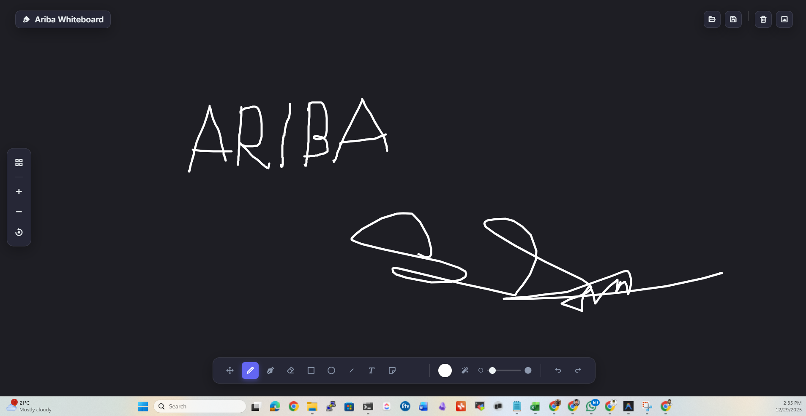

**An Enterprise-Grade HTML5 Infinite Canvas Whiteboard.**

Welcome to the **Ariba Online Whiteboard**, a powerful, lightweight, and collaborative-ready drawing tool built with vanilla JavaScript and HTML5 Canvas.

## 🚀 Features

-   **Infinite Canvas**: Pan and zoom without limits.
-   **Advanced Tools**:
    -   **Brush**: Smooth freehand drawing.
    -   **Eraser**: Precision removal of elements.
    -   **Highlighter**: Semi-transparent emphasis.
    -   **Shapes**: Rectangles, Circles, and Lines.
    -   **Text**: On-canvas WYSIWYG text editing.
    -   **Sticky Notes**: Create yellow sticky notes for brainstorming.
-   **Project Persistence**:
    -   **Save Project**: Export your work as a `.json` file to edit later.
    -   **Open Project**: Restore your workspace instantly.
    -   **Export Image**: Save your whiteboard as a `.jpg` image.
-   **Helpers**:
    -   **Grid System**: Infinite background grid for alignment.
    -   **Zoom Controls**: UI buttons for precise zoom management.

## 🛠️ Usage

1.  Open `index.html` in any modern web browser.
2.  Use the **Toolbar** at the bottom to switch tools.
3.  Use the **Left Sidebar** for grid and zoom (or use mouse wheel).
4.  Use the **Top Bar** to save/load your project.

## 👨‍💻 Author

**Ariba Soft**

## 📄 License & Attribution

This project is licensed under the **MIT License**.

> **⚠️ ATTRIBUTION REQUIREMENT:**
> If you update, modify, or redistribute this software, you **MUST credential the original author, Ariba Soft**. proper attribution is required in all derived works.

---

*Copyright © 2025 Ariba Soft. All Rights Reserved.*
