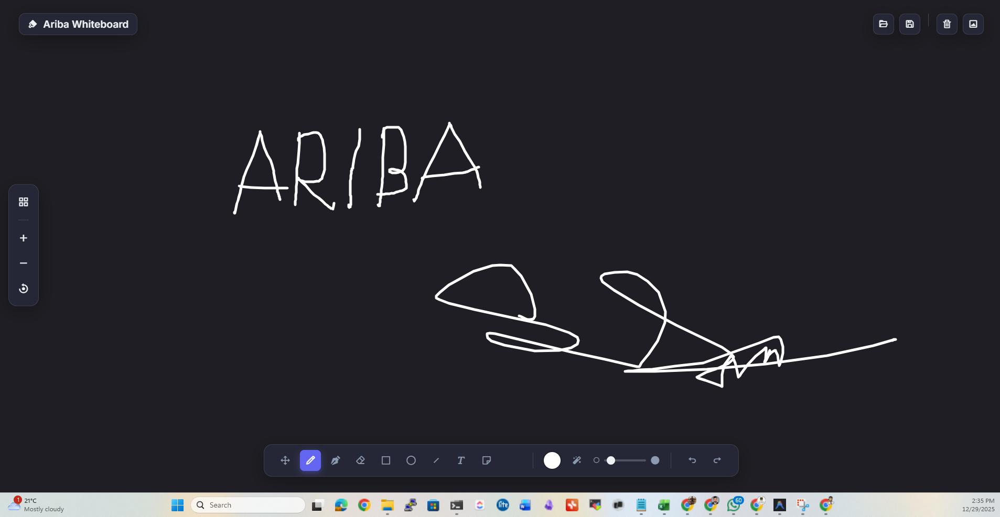

<div align="center">

  

  # Ariba Online Whiteboard

  **An Enterprise-Grade HTML5 Infinite Canvas Whiteboard.**

  [](LICENSE)
  [](script.js)
  []()

  <p align="center">
    A powerful, lightweight, and collaborative-ready drawing tool built with pure vanilla JavaScript and the HTML5 Canvas API. No external dependencies, just pure performance.
  </p>

  [Report Bug](https://github.com/boniyeamincse/Ariba-Online-Whiteboard/issues) • [Request Feature](https://github.com/boniyeamincse/Ariba-Online-Whiteboard/issues)

</div>

## 📚 Table of Contents

- [🚀 Features](#-features)
- [🛠️ Tech Stack](#-tech-stack)
- [🏁 Getting Started](#-getting-started)
- [🎮 Usage](#-usage)
- [📂 Project Structure](#-project-structure)
- [🗺️ Roadmap](#-roadmap)
- [🤝 Contributing](#-contributing)
- [📄 License & Attribution](#-license--attribution)
- [👨‍💻 Author](#-author)

---

## 🚀 Features

Experience a seamless drawing experience with our robust toolset:

- **∞ Infinite Canvas**: Pan and zoom without limits or loss of quality.
- **🎨 Advanced Tools**:
    - **Brush**: Smooth freehand drawing with customizable stroke width and color.
    - **Eraser**: Precision removal of elements.
    - **Highlighter**: Semi-transparent emphasis for annotating.
    - **Shapes**: Draw perfect Rectangles, Circles, and Lines instantly.
    - **Text**: On-canvas WYSIWYG text editing.
    - **Sticky Notes**: Create yellow sticky notes for brainstorming sessions.
- **💾 Project Persistence**:
    - **Save Project**: Export your entire workspace state as a `.json` file.
    - **Open Project**: Restore your work instantly from a saved file.
    - **Export Image**: Save your masterpiece as a high-quality `.jpg` image.
- **⚡ Helpers**:
    - **Grid System**: Infinite background grid for perfect alignment.
    - **Zoom Controls**: Easy-to-use UI interaction for precise zoom management.

## 🛠️ Tech Stack

This project is built with a focus on performance and simplicity:

- **Frontend**: HTML5, CSS3, Vanilla JavaScript (ES6+)
- **Graphics**: HTML5 Canvas API
- **Icons**: FontAwesome (CDN)
- **Fonts**: Google Fonts (Roboto)

## 🏁 Getting Started

To get a local copy up and running, follow these simple steps.

### Prerequisites
- A modern web browser (Chrome, Firefox, Edge, Safari).
- Git (optional, for cloning).

### Installation

1.  **Clone the repository**:
    ```bash
    git clone https://github.com/boniyeamincse/Ariba-Online-Whiteboard.git
    ```
2.  **Navigate to the project directory**:
    ```bash
    cd Ariba-Online-Whiteboard
    ```
3.  **Open the application**:
    - Simply double-click `index.html` to open it in your default browser.
    - OR serve it with a local server (e.g., Live Server in VS Code, Python):
    ```bash
    # using python
    python3 -m http.server
    ```

## 🎮 Usage

1.  **Select a Tool**: Click on any icon in the bottom toolbar (Brush, Shape, Text, etc.).
2.  **Draw/Edit**: Click and drag on the canvas to draw.
3.  **Pan/Zoom**:
    - **Pan**: Hold `Spacebar` + Drag (or Middle Mouse Button).
    - **Zoom**: content using `Ctrl` + `Scroll` or the zoom buttons on the left.
4.  **Save/Load**: Use the top menu bar to simple save your progress or export an image.

## � Project Structure

```bash
Ariba-Online-Whiteboard/
├── assets/             # Images and static assets
├── docs/               # Documentation files
├── index.html          # Main HTML entry point
├── style.css           # Global styles and UI theming
├── script.js           # Core application logic (Canvas, Tools, Events)
├── LICENSE             # MIT License file
├── README.md           # Project documentation
├── CONTRIBUTING.md     # Guidelines for contributors
└── CODE_OF_CONDUCT.md  # Community standards
```

## 🗺️ Roadmap

We have big plans for Ariba Online Whiteboard! Here's what's coming next:

- [ ] **Real-time Collaboration**: WebSocket integration for multi-user sessions.
- [ ] **Cloud Storage**: Save projects directly to the cloud (Firebase/Supabase).
- [ ] **Dark Mode**: Native dark theme support.
- [ ] **Mobile Support**: Touch gestures for tablets and phones.
- [ ] **Layer Management**: Reorder and lock elements on the canvas.

## 🤝 Contributing

Contributions are what make the open-source community such an amazing place to learn, inspire, and create. Any contributions you make are **greatly appreciated**.

Please read our [Contributing Guidelines](CONTRIBUTING.md) and [Code of Conduct](CODE_OF_CONDUCT.md) for details.

1.  Fork the Project
2.  Create your Feature Branch (`git checkout -b feature/AmazingFeature`)
3.  Commit your Changes (`git commit -m 'Add some AmazingFeature'`)
4.  Push to the Branch (`git push origin feature/AmazingFeature`)
5.  Open a Pull Request

## 📄 License & Attribution

Distributed under the **MIT License**. See `LICENSE` for more information.

> [!IMPORTANT]
> **ATTRIBUTION REQUIREMENT:**
> If you update, modify, or redistribute this software, you **MUST credential the original author, Ariba Soft**. Proper attribution is required in all derived works.

## 👨‍💻 Author

**Ariba Soft**
- GitHub: [@boniyeamincse](https://github.com/boniyeamincse)

---
<p align="center">
  Made with ❤️ by Ariba Soft
</p>
